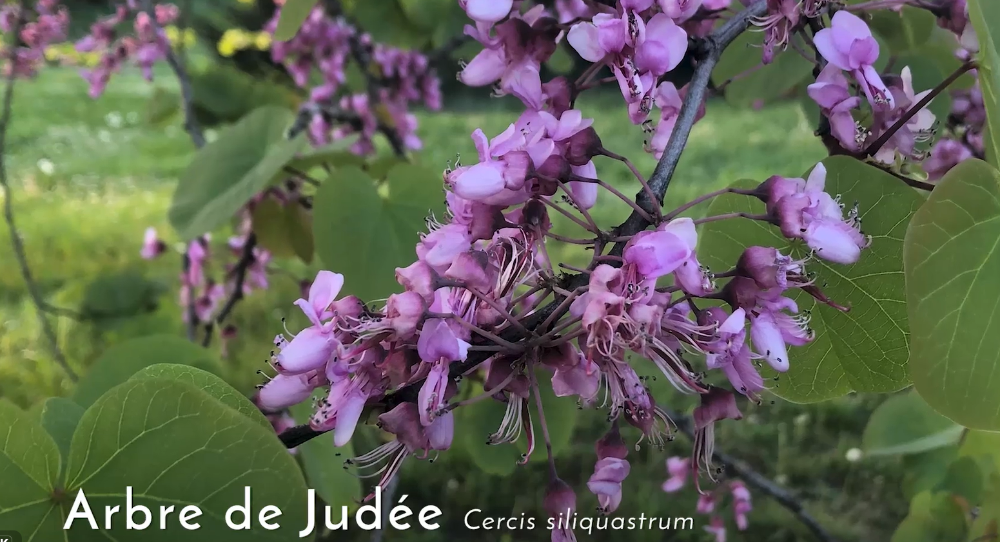

# Three Planting Guilds
### A proposal for next to the bike shed, the north garden, and a plum patch in the northwest garden

_(27826373314).jpg)

---

# Trees Don't Grow Alone in Nature

- **The guild concept**: Each tree gets companions that fill a distinct role — nitrogen fixer, mineral accumulator, pollinator attractor, pest deterrent, ground cover, and (for nut trees) a mycorrhizal fungal partner.

---

# Overview: Three Sites, Three Purposes

- **1. Next to the bike shed — Heartnut guild**: outcompete the Japanese knotweed already growing there, while harvesting nuts.
- **2. North garden — Chestnut guild**: elite, ungrafted seedlings left unpruned, for a multigenerational forest feel and a legacy planting.
- **3. Diverse plum patch — 5–6 small trees**: sour-sweet, partly-freestone plums for hand-eating and drying, mixing heritage Belgian kroosjespruimen with *Prunus cerasifera*.

---

# The "But Is It Native?" Question

- **Non-native is not the same as invasive**: none of heartnut, chestnut, or plum are on Belgium's invasive-species list. Japanese knotweed — the thing guild #1 is fighting — is.
- **Already naturalized here**: sweet chestnut and walnut relatives cultivated since Roman times; cherry plum already common in Belgian hedgerows; kroosjespruimen are a Flemish heritage landrace.
- **Same continent**: Chinese chestnut and heartnut come from elsewhere in Eurasia, the continent Belgium is on.
- **Wild-type trees are more disease-prone**: wild European chestnut is highly disease-susceptible, which is why resilient cultivated selections exist.
- **Most of the guild layer *is* native**: comfrey, yarrow, clover, wild strawberry, borage, chives, bramble — the majority of species in every guild.
- **Climate change motivates bringing in new species/varieties to replace species/varieties now going into decline**

---

# Japanese Knotweed: What Control Actually Looks Like
### Setting expectations before Guild 1

- **Foliar spray**: herbicide sprayed on leaves. Highest drift risk — canes reach 3m+, hard to target, real risk to nearby young trees.
- **Stem injection** (the likely professional method): glyphosate injected directly into each hollow cane, ~20–30cm above the base. Herbicide stays inside the stem — much lower risk to anything planted nearby.
- **Timing**: best done in early autumn (~September), when the plant is naturally moving sugars — and with them, the herbicide — down into the rhizomes for winter. Matches what's already understood about how this is typically done.
- **Realistic timeline either way**: knotweed control usually takes 3–5 years of repeated treatment, not a single pass.
- **Non-chemical options**: repeated cutting (slow, no chemicals) or root barrier/excavation (physical, but excavated material is regulated waste).
- **Not ours to decide**: the contractors handle the initial knotweed control. It matters to us only for timing — trees go in after treatment, or with a clear no-spray zone around them.

---

# Guild 1 — Heartnut Next to the Bike Shed
### Fighting knotweed with a forest

- **The problem**: Japanese knotweed growing next to the bike shed (the shed itself stays put) — legally regulated; careless rhizome disturbance spreads it further.
- **The tree**: Heartnut (*Juglans ailantifolia* var. *cordiformis*) — dense shade canopy, mild allelopathic juglone, easy-to-crack heart-shaped nuts.
- **How it helps**: shade + juglone + a competitive understory (next slides) suppress knotweed's vigor over time.
- **Being honest about limits**: suppression and displacement, not instant eradication — the trees complement the contractors' initial knotweed control, they don't replace it.
- **Expect a real tree**: ~3–4m at 5 years, ~6–8m at 10 years, ~15–20m mature — exact spot decided case-by-case.
- **Buy**: [Eetbaargoed — heartnut 'Anneke'](https://www.eetbaargoed.nl/product/japanse-hartnoot-heartnut-juglans-ailantifolia-anneke/) · [Arborealis — heartnut, 60–80cm](https://www.arborealis.nl/juglans-ailantifolia-cordiformis-c4-60-80)

---

# Guild 1 — Two Trees, Not One
### Why heartnut needs a pollen partner

- **Our existing walnut can't be assumed to do it**: it's European walnut (*J. regia*), a different section of the genus than heartnut — plausible pollen compatibility, but unconfirmed, and bloom timing would still need to overlap.
- **Heartnuts are dichogamous**: male and female flowers on the same tree bloom at different times, so a lone tree rarely sets a real crop.
- **Two options for the second tree**: a second heartnut, or a **buartnut** (*J. × bixbyi*, butternut × heartnut) — a documented compatible pollinator that also inherits canker resistance from the heartnut side (pure butternut has been decimated by canker elsewhere).
- **Or reconsider the tree entirely**: an easy-shell ***J. regia*** **cultivar like 'Broadview'** cross-pollinates reliably with our *existing* walnut (same species) — possibly only one new tree needed, not two. [Buy 'Broadview' — Bomen & Enzo](https://www.bomenenzo.nl/walnotenboom-broadview) · [Boomkwekerij Joos (BE)](https://www.boomkwekerijjoos.be/nl/referenties/referenties-cat/meerstammige-bomen-cat/juglans-regia-broadview.htm)
- **Keeping the footprint small**: plant the pair close (~5–6m apart) — proximity helps pollination and mutual crowding naturally limits lateral spread — and/or keep the second tree pollarded as a dedicated pollinizer rather than grown for its own full nut crop.
- **Trade-off, stated plainly**: crowded/pollarded trees yield fewer nuts per tree and may grow lopsided — a fair trade for avoiding two full-size 15–20m trees.

---

# Guild 1 Companions — Juneberry
### *Amelanchier lamarckii*, krentenboompje (4–8m)

- **Fits under walnut**: part-shade tolerant, and serviceberries are widely listed as juglone-tolerant (not tested for heartnut specifically).
- **Edible fruit** for people and birds, and spring blossom.
- **Self-fertile**: one tree is enough.
- **In the adjacent wadi**: probably yes. On the RHS list for wet soils and copes with short floods, but prefers moist, well-drained ground, so the wadi's edge suits it better than the bottom.

---

# Guild 1 Companions — Pawpaw
### *Asimina triloba* (~5m)

- **Fits under walnut**: juglone- and shade-tolerant.
- **Large, sweet fruit**, ripening early September to mid October in the Netherlands (reliability in Ghent not confirmed).
- **Needs a partner**: a second, genetically different pawpaw within ~10–15 m; 'Sunflower' is the exception that sets fruit alone. Pollinated by flies and beetles, so hand-pollination may be needed.
- **Buy**: Boomkwekerij Bogaert (BE).
- **In the adjacent wadi**: possibly, on the upper edge. Tolerates periodic flooding better than most fruit trees, but waterlogged roots rot and it prefers good drainage.

---

# Guild 1 Companions — Judas Tree
### *Cercis siliquastrum* (~6–8m), the European redbud

- **Ornamental**: deep pink blossom along bare branches and even the trunk in mid spring — something the neighbours will enjoy. Cultivars: 'Bodnant' (dark purple), 'Alba' (white).
- **Edible flowers**: sweet-sour, rich in vitamin C; eaten in salads, buds pickled as a caper substitute. (Pods are reported bitter.)
- **Fits under walnut**: *Cercis* is reported growing under walnuts (genus-level reports; not tested for this species or for heartnut).
- **One tree is enough for flowers.**
- **Taste, one anecdote**: in a French video filmed on a tree in Nancy, a man eats the flowers straight off the branch and says they're good.

- **In the adjacent wadi**: no. It dislikes wet soil, especially wet clay (root rot), though it is very drought-tolerant once established; keep it on the well-drained side.
- **Buy**: [Bomen & Enzo — 'Bodnant'](https://www.bomenenzo.nl/cercis-bodnant) · [DirectPlant (NL/BE pickup)](https://www.directplant.nl/judasboom-cercis-siliquastrum.html) · [ATuin (BE)](https://www.atuin.be/tuincentrum/struiken/judasboom-cercis-siliquastrum/) · [Willaert (BE trade nursery)](https://www.willaert.be/nl/plant/cercis+siliquastrum/cersiliq)

---

# Guild 1 Companions — Understory Plants
### The plants doing the knotweed-suppressing work at ground level

- **Comfrey and bramble margin**: fast, dense growth that competes with knotweed for light and space.
- **Clover and wild strawberry**: close the remaining gaps at soil level.
- **Goumi (*Elaeagnus multiflora*)**: nitrogen-fixing shrub.
- **Keep juglone-sensitive plants** (tomatoes, azaleas, rhododendron) outside the heartnut's drip line.

---

# Guild 2 — Chestnut in the North
### A tree for the grandchildren

- **Elite seedlings, own-rooted**: grown from superior parents — no graft union, no graft-failure risk, each tree genetically unique.
- **Unpruned, natural form**: full "pillar" canopy rather than a trained commercial vase shape.
- **Multigenerational**: seedling chestnuts can live for centuries — a legacy planting, not a yield optimization.
- **Size over time**: ~2–3m at 5 years, ~5–7m at 10 years, up to 20–30m mature — informal placement, not a planned layout.
- **Guild support**: goumi/clover (nitrogen), comfrey/yarrow (mulch minerals), borage/phacelia (pollinators), King Bolete mycorrhizae.
- **Buy**: [Eetbaargoed — elite seedlings (Grimo/Hebei North/SemRu)](https://eetbaargoed.nl) · [Calle Steven, Wetteren (BE)](https://www.callesteven.be) · [Plantencentrum Maréchal (BE)](https://www.marechal.be)
- *Photo note: this is* Castanea mollissima *(Chinese chestnut, the species behind the elite seedling lines proposed) — no photo of the specific named seedling lines exists publicly, since they're seedling selections, not registered cultivars.*

_(27826373314).jpg)

---

# Guild 2 — Why *mollissima*, Not *sativa*?
### Chinese vs. European chestnut nuts

| | *C. mollissima* (proposed) | *C. sativa* (the "local" one) |
| :--- | :--- | :--- |
| **Flavor** | Sweet, waxy texture | Good, but variable |
| **Peeling** | Inner skin (pellicle) peels easily, doesn't intrude into the nut | Inner skin often clings/intrudes in many types |
| **Blight** | Naturally resistant | Susceptible |
| **Ink disease** | More resistant (drainage still matters) | Highly susceptible in wet soil |
| **Nut size** | Small to large, varies by line | Often larger |

   

*Left to right: mollissima 'Qing' nuts (Chestnut Improvement Network); open bur (Canopy Nursery); sativa nuts and bur (H. Zell, CC BY-SA).*

---

# Guild 2 — The Double Harvest
### Nuts above, mushrooms below

- **Ectomycorrhizal partnership**: chestnuts form symbiotic relationships with King Bolete (*Boletus edulis* / porcini) fungi.
- **Nutrient exchange**: the tree provides sugars; the fungi provide minerals, water, and drought resilience.
- **Second crop**: managed groves in Spain and China harvest up to 40kg of porcini per hectare from the same land as the nut harvest.
- **Buy pre-inoculated**: [Robin Pépinières (FR)](https://www.robinpepinieres.com) · [Hifas da Terra (ES)](https://hifasforesta.com)

---

# Guild 3 — A Diverse Plum Patch
### Small, sour, and worth drying — many kinds, one tidy patch

- **Diversity as the design**: several plum types side by side, spreading risk (bloom timing, frost, disease, a bad year for one kind) and extending the harvest across the season.
- **Three types, different jobs**: kroosjespruimen and Belgian kwetsen (freestone, dry well) vs. fruiting *P. cerasifera* (juicier, clingstone — fresh-eating/rootstock).
- **Rooted in local heritage**: 'Altesse Double' (Kattetongen), 'Bleue de Belgique' — traditional Belgian drying plums; 'Belle de Louvain' — larger culinary variety.
- **Local sourcing**: Wetteren (15km from Ghent) — [Boomkwekerij Calle Steven](https://www.callesteven.be) stocks heritage kwetsen and kroosjes directly, and is the same nursery already listed for the chestnut guild.
- **Diversity that stays tidy**: the patch can keep adding varieties over time by grafting onto root suckers, with **one variety per stem** so it always reads as a cluster of distinct small trees.
- **Stays small**: ~2–3m at 5 years, mature height only ~4–6m — the smallest-footprint guild, real flexibility in placement.

---

# Two Cherry Trees
### Chosen for early ripening, fewer losses, and a cross-pollinating pair

- **Why early**: our late dark-red dwarf kept failing (mold, birds, disease); an earlier crop is off the tree before the wettest, most humid weeks of summer.
- **Why pale**: birds often ignore yellow cherries — they don't look ripe.
- **Sweet cherries need a partner**: most are self-incompatible, so the two trees must be a compatible pair (or one self-fertile variety).

| Option | Ripens | Colour | Pairing |
| :--- | :--- | :--- | :--- |
| **'Bigarreau Burlat' + 'Early Rivers'** | Very early (late May–mid June) | Dark red | Standard early pair; both sold in Belgium |
| **'Sunburst'** (self-fertile) or **'Stella'** | Early–mid | Dark red | No partner needed |
| **'Dönissens Gelbe'** (yellow) | Mid (5th–6th cherry week, ~mid-July) | Yellow — birds mostly ignore | Needs a partner blooming with it |

- **Honest trade-off**: the earliest cherries are dark red, and the yellow one ripens later. Early Burlat also splits in rain.
- **Our existing 'bigarreau blanc et rose'** may already pollinate a new tree if it is close enough for bees.

---

# What We're Asking For Tonight

- **Site approval**: the area next to the bike shed, the north garden, and the plum-patch zone for these three guilds.
- **Sequencing**: guild 1 is planted after the contractors' knotweed treatment near the bike shed, so its timing follows theirs.
- **Budget/sourcing**: seedling and companion-plant costs are modest; nursery shortlist is in the supporting research doc.
- **Open question**: approve all three together, or prioritize (knotweed control is the most time-sensitive)?
