# Drie beplantingsvoorstellen
### Naast de fietsenstalling · de noordtuin · een pruimenbosje

[English version](index.html)

_(27826373314).jpg)

---

# De voorstellen

1. **Hartnoot**, naast de fietsenstalling
2. **Kastanje**, in het noorden
3. **Gevarieerd pruimenbosje**, 5–6 kleine bomen

Elke boom krijgt enkele bijbehorende planten.

<!-- Gilde = een boom met begeleidende planten die elk een taak hebben: stikstof binden, mulch leveren, bestuivers voeden, samenwerken met schimmels. De kersen (twee bomen) komen na de gilden. -->

---

# Inheems of niet?

- Geen van deze staat op de lijst van invasieve soorten. Duizendknoop wel.
- Kastanje, walnoot, kerspruim en kroosjes hebben hier een lange geschiedenis.
- De meeste begeleidende planten zijn inheems.

<!-- Wilde Europese kastanje is erg ziektegevoelig; daarom bestaan er weerbare selecties. Klimaatverandering is een reden om nieuwe soorten en rassen te halen die soorten vervangen die achteruitgaan. Chinese kastanje en hartnoot komen uit een ander deel van Eurazië, hetzelfde continent. Details: onderzoeksdocument (Engels), sectie 0. -->

---

# De duizendknoop

- De aannemers pakken de eerste behandeling aan.
- Stam-injectie in het vroege najaar is de waarschijnlijke methode.
- Bomen gaan erin daarna, of met een spuitvrije zone.

<!-- Niet onze beslissing. Bladspuiten drijft af en kan jonge bomen schaden; injectie in de holle stengel blijft in de stengel. Bestrijding duurt meestal 3–5 jaar met herhaalde behandelingen. Andere opties: herhaald maaien, wortelscherm, afgraven (gereglementeerd afval). Details: onderzoeksdocument, sectie 1. -->

---

# 1. Hartnoot naast de fietsenstalling

- Schaduw en een dichte beplanting helpen duizendknoop terug te dringen.
- Hartvormige noten met hele kernen.
- Vult het werk van de aannemers aan, vervangt het niet.

<small>Kopen: [Eetbaargoed 'Anneke'](https://www.eetbaargoed.nl/product/japanse-hartnoot-heartnut-juglans-ailantifolia-anneke/) · [Arborealis](https://www.arborealis.nl/juglans-ailantifolia-cordiformis-c4-60-80)</small>

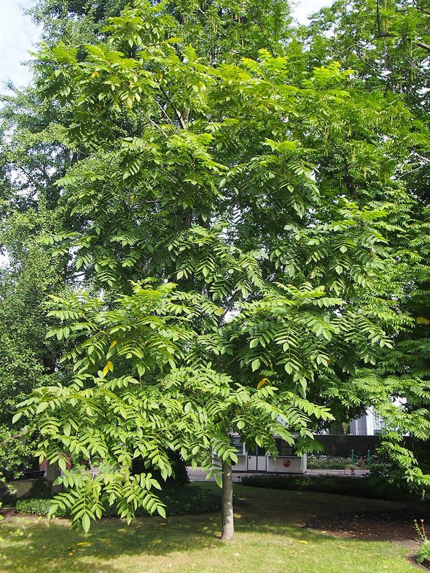

<!-- Grootte: ongeveer 3–4 m na 5 jaar, 6–8 m na 10 jaar, 15–20 m volgroeid (schattingen). Exacte plek per geval te bepalen. Bewijs: we vonden geen studie die aantoont dat schaduw of juglon van walnoot duizendknoop onderdrukt; wilg vermindert hem wel, maar verdrijft hem niet. Dit is dus een hoop, geen belofte. Hardheid van de schaal: bronnen verschillen; sommigen noemen de schaal hard, kwekers zeggen dat de kern heel uitvalt als je op de rand kraakt. -->

---

# Hoe een hartnoot eruitziet

- Hartvormige noten; de kern komt heel uit de schaal.
- Verkopers beschrijven een milde, zoete smaak.

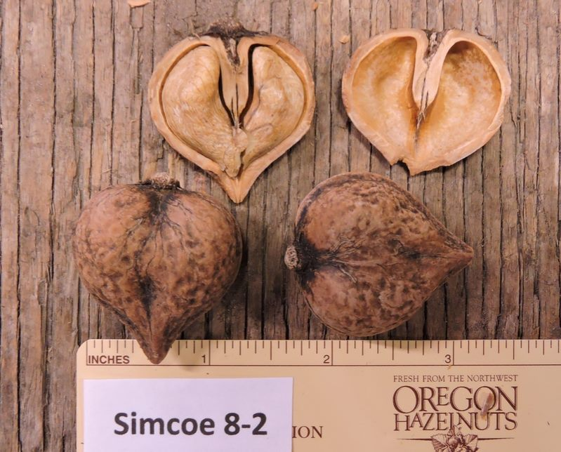 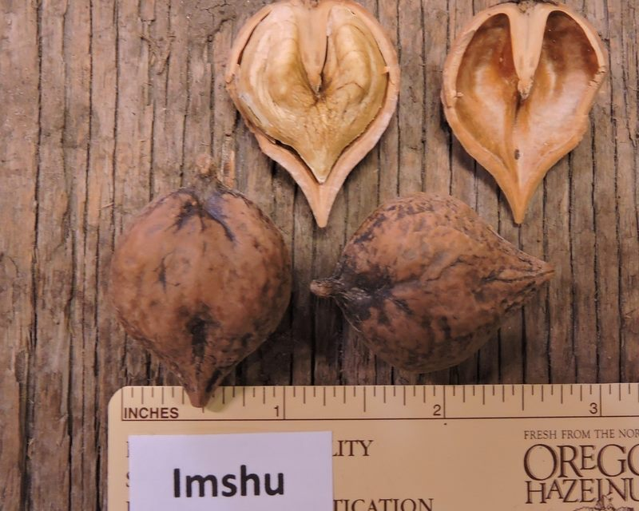 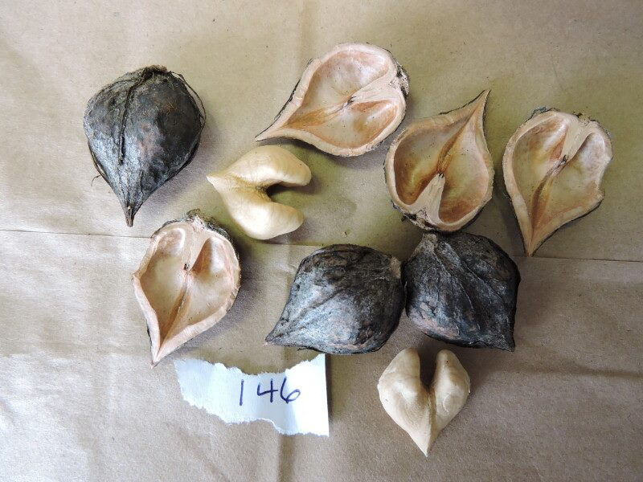

*Simcoe, Imshu, Bernice. Foto's: Grimo Nut Nursery*

<!-- Deze cultivars komen van een Canadese kwekerij (Grimo) en tonen het type; in NL/BE verkopen ze Anneke, Shubert (een oudere vorm van Imshu), Campbell CW4 en Grimo Manchurican. Verkopers zeggen dat de kern heel uitvalt als je op de rand kraakt; Imshu vraagt zorg. Rijpt eind september, noten vallen en gaan na drogen makkelijk open (Eetbaargoed). -->

---

# Hartnoot heeft een partner nodig

- Eén enkele hartnoot zet zelden noten.
- Tweede hartnoot of buartnoot, dicht erbij (~5–6 m).
- Of één walnoot met makkelijk kraakbare noten ('Broadview') die past bij onze bestaande walnoot.

<small>Kopen buartnoot: [De Nootsaeck 'Mitchell'](https://www.denootsaeck.com/nl/walnootboom-mitchell-buartnut.html)</small>

<small>Kopen 'Broadview': [Bomen & Enzo](https://www.bomenenzo.nl/walnotenboom-broadview) · [Boomkwekerij Joos](https://www.boomkwekerijjoos.be/nl/referenties/referenties-cat/meerstammige-bomen-cat/juglans-regia-broadview.htm)</small>

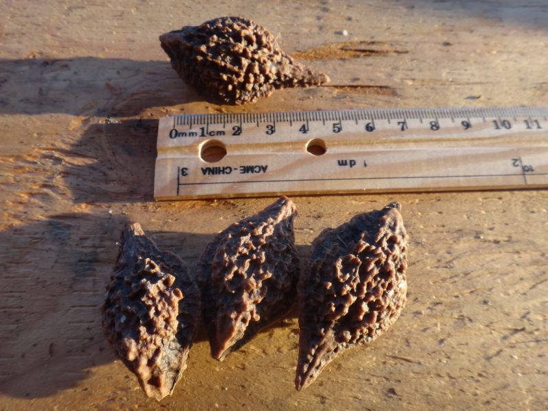

<!-- Foto: buartnoten (Nutcracker Nursery, Frankrijk; niet als 'Mitchell' gelabeld). Grimo zegt dat 'Mitchell' met een grijze walnoot (zaailing of geënt) bestoven moet worden, terwijl De Nootsaeck hem zelfbestuivend noemt: onopgelost. Mannelijke en vrouwelijke bloemen op één hartnootboom bloeien op verschillende momenten (dichogamie). Onze bestaande Europese walnoot bestuift een hartnoot misschien wel of niet: onbevestigd. 'Broadview' is dezelfde soort als onze walnoot. Buartnoot = grijze walnoot x hartnoot, weerstaat de kanker die zuivere grijze walnoot treft. Dicht op elkaar planten of knotten houdt de voetafdruk klein; kost wat noten en geeft scheve kronen. -->

---

# Begeleider: krentenboompje

*Amelanchier lamarckii* · 4–8 m

- Eetbare besjes, lentebloesem.
- Verdraagt schaduw en walnoot.
- Rand van de wadi: waarschijnlijk goed.

<!-- Krenteboompjes staan op veel lijsten als juglon-tolerant (niet getest bij hartnoot). Zelfvruchtbaar, één boom volstaat. Staat op de RHS-lijst voor natte grond; verdraagt korte overstromingen, verkiest vochtige maar goed doorlatende grond. -->

---

# Begeleider: pawpaw

*Asimina triloba* · ~5 m

- Grote zoete vruchten.
- Verdraagt schaduw en walnoot.
- Heeft een tweede pawpaw nodig binnen ~10–15 m.

<small>Kopen: [De Nootsaeck 'Sunflower'](https://www.denootsaeck.com/nl/pawpaw-boom-asimina-triloba-sunflower.html) · [Eetbaargoed](https://www.eetbaargoed.nl/product/pawpaw-asimina-tribola-kopen/) · [Kwekerij Asimina](https://www.kwekerij-asimina.nl/)</small>

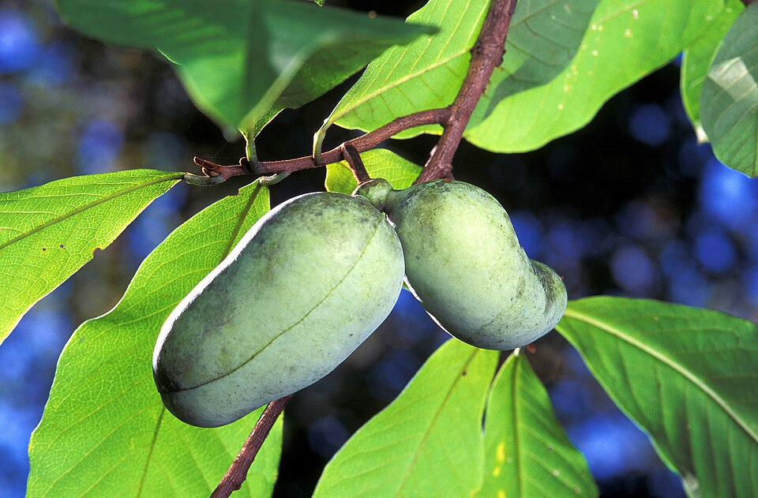

<!-- 'Sunflower' zet alleen vrucht, maar geeft meer met een partner. Vliegen en kevers bestuiven, dus handbestuiving kan nodig zijn. Rijpt begin september tot half oktober in Nederland; betrouwbaarheid in Gent niet bevestigd. Geënte bomen dragen na 3–4 jaar, zaailingen na 5–8. Draagt veel minder in diepe schaduw. Wadi: alleen bovenrand. Duitse kwekers zeggen dat een regenachtige, koele zomer rijping moeilijk maakt; geen Belgische opbrengstgegevens gevonden. Verkrijgbaar bij De Nootsaeck ('Sunflower'), Eetbaargoed en Kwekerij Asimina. -->

---

# Begeleider: Judasboom

*Cercis siliquastrum* · 6–8 m of meer

- Roze bloesem op kale takken, voor de buren.
- De bloemen zijn eetbaar, zoetzuur.
- Niet voor de wadi.

<small>Kopen: [Bomen & Enzo 'Bodnant'](https://www.bomenenzo.nl/cercis-bodnant) · [ATuin](https://www.atuin.be/tuincentrum/struiken/judasboom-cercis-siliquastrum/)</small>

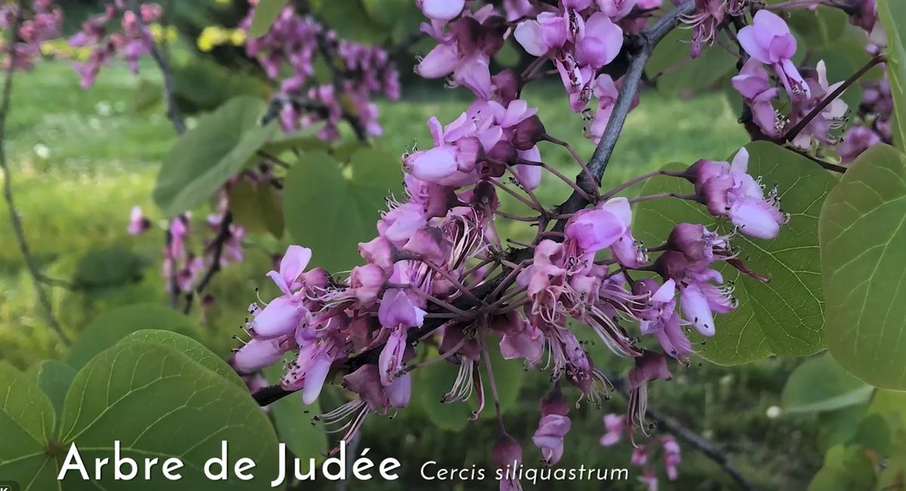

<!-- Cultivars: 'Bodnant' (donkerpaars), 'Alba' (wit). In salades; knoppen ingelegd als kappertjes. Peulen zouden bitter zijn. Eén anekdote: een Franse video uit Nancy waarin een man de bloemen van de boom eet en zegt dat ze lekker zijn. Smaak is verder onbewezen dan beschrijvingen. Groeit volgens meldingen onder walnoten (op geslachtsniveau, niet getest). Houdt van zon en goed gedraineerde grond; houdt niet van natte klei. Eén boom volstaat voor de bloemen. Zaailingen kunnen ~15 jaar nodig hebben om te bloeien; koop een grotere kwekerijboom. 'Bodnant' groeit langzaam, ongeveer 3 m na 10 jaar; verwacht de hoogte dus laat. -->

---

# Begeleider: ondergroei

- Smeerwortel, braam, klaver, bosaardbei.
- Goumi bindt stikstof.
- Houd tomaten en azalea's uit de buurt van de walnoot.

<!-- Deze concurreren op grondniveau met de duizendknoop. Juglon-gevoelige planten blijven buiten de druiplijn van de hartnoot. -->

---

# 2. Kastanje in het noorden

- Elite-zaailingen, eigen wortels, niet geënt.
- Ongesnoeid: een echte bosboom.
- Voor de kleinkinderen.

<small>Kopen: [Eetbaargoed Grimo](https://www.eetbaargoed.nl/product/tamme-kastanje-castanea-grimo-serie/) · [Eetbaargoed SemRu](https://www.eetbaargoed.nl/product/tamme-kastanje-castanea-mollisima-label-semru-unieke-genenpoel-afkomstig-uit-noordelijk-beijing/) · [De Bomelaar](https://debomelaar.be/webshop/zaailing-Chinese-kastanje-mollissima-p706207844)</small>

_(27826373314).jpg)

<!-- Zaailingen vermijden enting-uitval en kunnen eeuwen leven. Grootte: ongeveer 2–3 m na 5 jaar, 5–7 m na 10 jaar, 20–30 m volgroeid. Plaatsing informeel. Minstens twee genetisch verschillende bomen nodig voor noten. De foto toont de soort Castanea mollissima; er zijn geen openbare foto's van de genoemde zaailinglijnen. -->

---

# Waarom Chinese, niet Europese kastanje?

| | Chinees (*mollissima*) | Europees (*sativa*) |
| :--- | :--- | :--- |
| Pellen | Meestal makkelijk | Wisselt |
| Kastanjekanker | Resistent | Gevoelig |
| Inktziekte | Beter bestand | Zeer gevoelig |

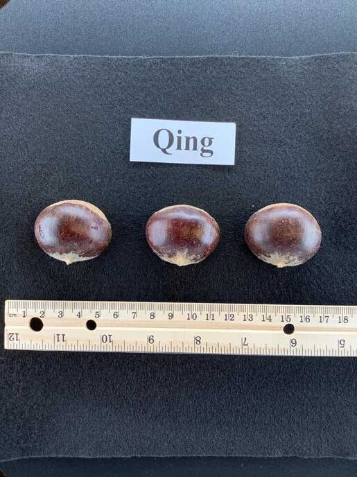 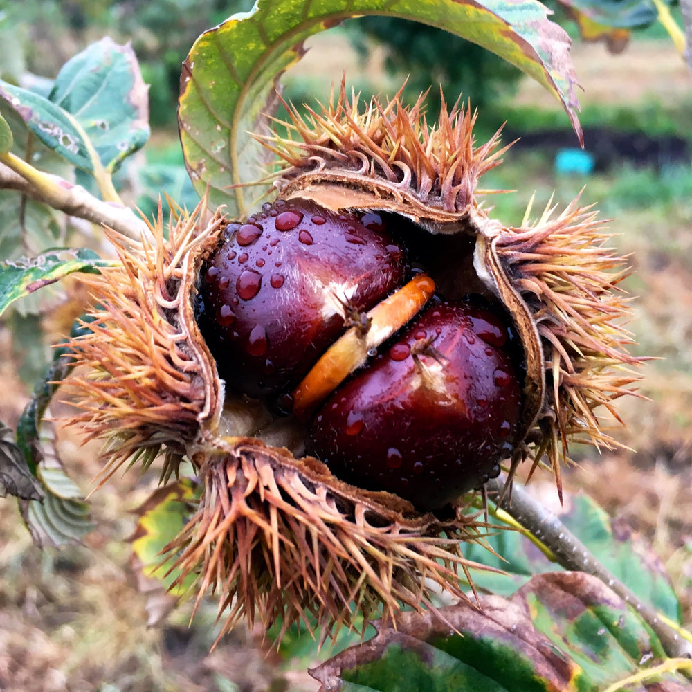 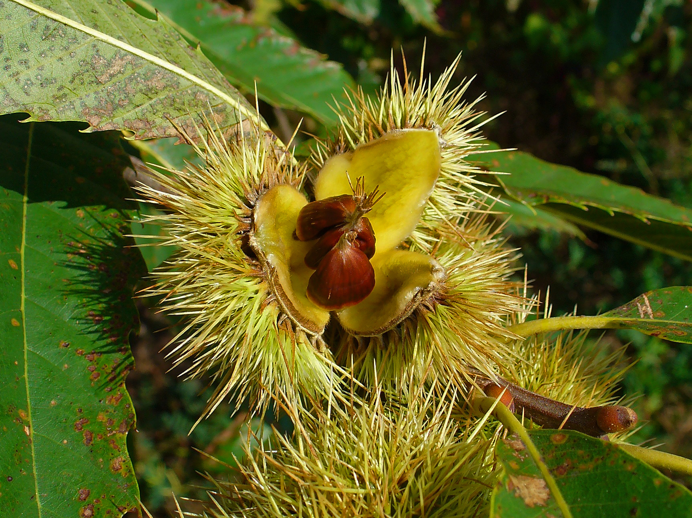 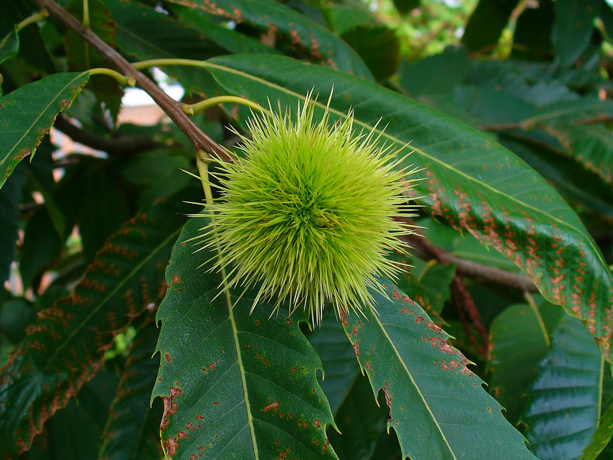

*Chinese 'Qing'-noten en bolster · Europese noten en bolster*

<!-- Chinese noten worden beschreven als zoet en waskachtig. De notengrootte is bij beide vergelijkbaar; veel cultivars van beide pellen makkelijk. Chinese kastanje is resistent tegen kanker en inktziekte maar gevoelig voor waterverzadiging, dus de drainage van de noordtuin moet vóór het planten gecontroleerd worden. We vonden geen onafhankelijke meldingen over de lijnen Grimo, Hebei North of SemRu in België, Nederland of Duitsland. Fotocredits: 'Qing'-noten, Chestnut Improvement Network; bolster, Canopy Nursery; sativa-foto's, H. Zell (CC BY-SA). -->

---

# Noten boven, paddenstoelen onder

- Kastanjes gaan een samenwerking aan met eekhoorntjesbrood.
- Vooraf geïnoculeerde bomen bestaan.

<small>Kopen: [Robin Pépinières](https://www.robinpepinieres.com) · [Hifas da Terra](https://hifasforesta.com)</small>

<!-- De boom geeft de schimmel suikers; de schimmel geeft mineralen en water. Beheerde bossen in Spanje en China melden tot 40 kg eekhoorntjesbrood per hectare. Wortelkolonisatie van geïnoculeerde Europese kastanje is gedocumenteerd; we vonden geen meldingen van paddenstoelen die hier of bij Chinese kastanje verschijnen, dus zie de paddenstoelenoogst als mogelijke bonus. Bronnen zijn Franse en Spaanse kwekerijen. -->

---

# 3. Een gevarieerd pruimenbosje

- Ongeveer zes soorten, zodat bestuiving ruim volstaat.
- Kleine bomen: 4–6 m volgroeid.
- Oude Belgische pruimen, goed vers en gedroogd.

<small>Kopen: [Willaert 'Bleue de Belgique'](https://www.willaert.be/nl/plant/PRUNUS+DOMESTICA+%27BLUE+DE+BELGIQUE%27/prdbbelg) · [Houtmeyers 'Altesse Double'](https://houtmeyers.be/product/altesse-double/) · [Fruitbomen.net 'Belle de Louvain'](https://fruitbomen.net/webwinkel/pruimenbomen/belle-de-louvain) · [kroosjes (De Bomenshop)](https://www.debomenshop.nl/pruimenboom/1305-prunus-insititia-gele-kroos-kroosjes-pruim.html)</small>

<!-- Kroosjes en Belgische kwetsen ('Altesse Double', 'Bleue de Belgique') hebben een losse pit en drogen goed. Prunus cerasifera is sappiger, met vaste pit: vers eten en onderstam. Nieuwe rassen kunnen na verloop van tijd op worteluitlopers geënt worden, één ras per stam, zodat het een nette groep aparte bomen blijft. Kandidaat-zes (eind juli tot september, voorlopig): 'Sint-Hubertus', rode kroosje, 'Bleue de Belgique', blauwe kroosje, 'Altesse Double', één kerspruim-selectie. De meeste zijn zelfvruchtbaar; bloeidata per ras niet gecontroleerd. Mogelijke verkopers: Willaert, Houtmeyers, Ecoflora, Fruitbomen.net; vraag Calle Steven in Wetteren welke pruimen ze hebben. -->

---

# Twee kersenbomen

- Vroege rijping: van de boom voor de natte, vochtige weken.
- Lichte vruchten: vogels laten gele kersen vaak liggen.
- De twee bomen moeten elkaar bestuiven.

| Optie | Rijp | Kleur |
| :--- | :--- | :--- |
| Burlat + Early Rivers | Zeer vroeg | Donkerrood |
| Sunburst of Stella (zelfvruchtbaar) | Vroeg–midden | Donkerrood |
| Dönissens Gelbe (heeft een partner nodig) | Half juli | Geel |

<small>Kopen: [Burlat](https://fruitbomen.net/webwinkel/kersenbomen/bigarreau-burlat) · [Early Rivers](https://fruitbomen.net/webwinkel/kersenbomen/early-rivers) · [Sunburst](https://fruitbomen.net/webwinkel/kersenbomen/sunburst) · [Stella](https://fruitbomen.net/webwinkel/kersenbomen/kersenboom-stella) · [Dönissens](https://fruitbomen.net/webwinkel/kersenbomen/donissens) (all Fruitbomen.net)</small>

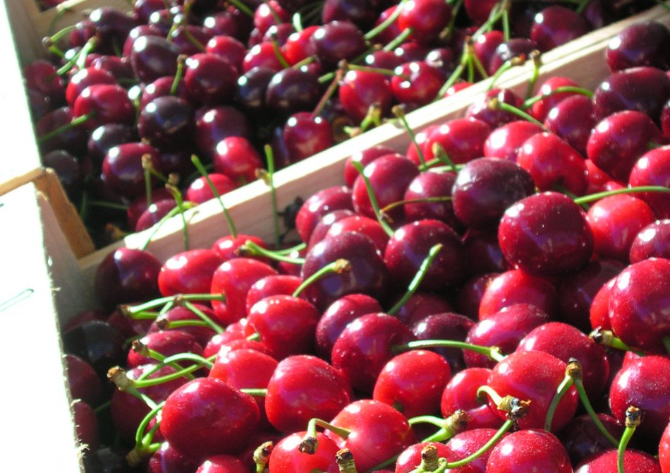
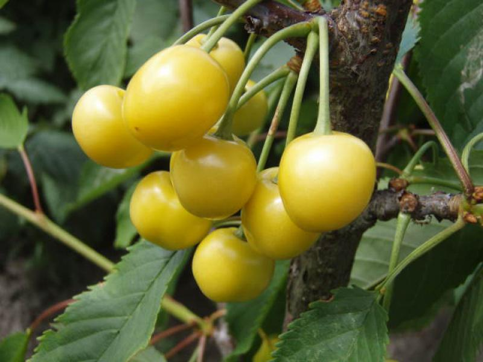

<!-- Nadeel: de vroegste zijn donkerrood; de gele is later. Burlat barst bij regen. Onze bestaande 'bigarreau blanc et rose' bestuift misschien een nieuwe boom als hij dichtbij genoeg staat voor bijen (identiteit onbevestigd; mogelijk Napoleon). Geen vroege gele kers met bevestigde partner gevonden. Burlat (S3S9) en Early Rivers (S1S2) delen geen S-allel en zijn dus volledig compatibel; Burlat met Napoleon (S3S4) is maar half compatibel. Bloeitijd van geen enkel paar bevestigd. Burlats resistentie tegen kanker is omstreden. Volledig gele kersen ontsnappen misschien aan vogels; kersen met een blos worden aangevallen zodra ze kleuren. Details: onderzoeksdocument sectie 3.4 en docs/research_notes/cherries.md. -->

---

# Waar kopen

- **Hartnoot:** [Eetbaargoed](https://www.eetbaargoed.nl/product/japanse-hartnoot-heartnut-juglans-ailantifolia-anneke/) · [Arborealis](https://www.arborealis.nl/juglans-ailantifolia-cordiformis-c4-60-80)
- **Walnoot 'Broadview':** [Bomen & Enzo](https://www.bomenenzo.nl/walnotenboom-broadview) · [Boomkwekerij Joos](https://www.boomkwekerijjoos.be/nl/referenties/referenties-cat/meerstammige-bomen-cat/juglans-regia-broadview.htm)
- **Judasboom:** [Bomen & Enzo](https://www.bomenenzo.nl/cercis-bodnant) · [ATuin](https://www.atuin.be/tuincentrum/struiken/judasboom-cercis-siliquastrum/)
- **Kastanje, pruimen, pawpaw:** [Calle Steven](https://www.callesteven.be) · [Bogaert](https://www.boomkwekerij-bogaert.be) · [Eetbaargoed](https://eetbaargoed.nl)
- **Geïnoculeerde kastanje:** [Robin Pépinières](https://www.robinpepinieres.com)

<!-- Prijzen en voorraad niet gecontroleerd. Volledige leverancierslijst: onderzoeksdocument sectie 5 en data/vendors.toml. -->

---

# Ter beslissing

- Locaties voor de drie voorstellen.
- De timing van de duizendknoopbestrijding bepaalt wanneer de hartnoot erin gaat.
- Alle drie samen, of welke eerst?

---

<!-- _class: credits -->

# Fotocredits

<small>Chinese kastanje, Fallopia japonica, kroosje, hartnoot, eekhoorntjesbrood en Judasboombloemen: Wikimedia Commons (diverse auteurs, CC BY-SA / publiek domein; zie docs/research_notes/image_sources.md). Pawpaw: Scott Bauer, USDA ARS. Kastanjenoten: Chestnut Improvement Network; Canopy Nursery. Europese kastanje: H. Zell, CC BY-SA. Kersen: Fruitbomen.net; Baumschule Eggert. Hartnootfoto's: Grimo Nut Nursery; hele boom: Wikimedia Commons (botanische tuin Wroclaw, CC BY-SA 4.0); buartnoten: Nutcracker Nursery. Judasboom in Nancy: schermafbeelding uit een Franse video.</small>
