# Drie gilden voor Cohousing Bourgoyen
### Hartnoot · Kastanje · Pruim

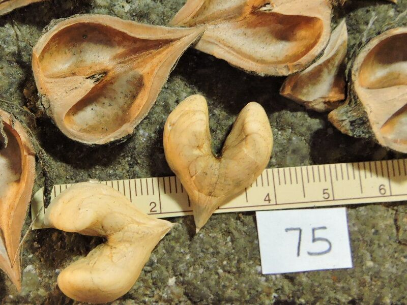  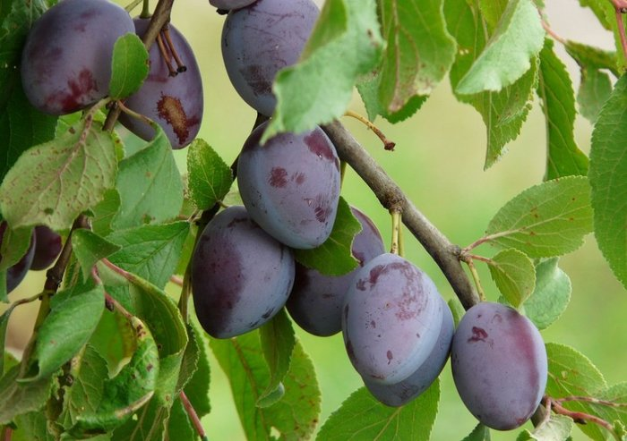

*Hartnootkernen · Chinese kastanjes ('Qing') · pruimen ('Bleue de Belgique')*

[English version](index.html)

<!-- Foto's: hartnootkernen, Grimo Nut Nursery; Chinese kastanje 'Qing'-noten, Chestnut Improvement Network; pruimen 'Bleue de Belgique', Fruitbomen.net. Een gilde is een boom met begeleidende planten die elk een taak hebben. -->
---

# De voorstellen

1. **Hartnoot**, naast de fietsenstalling, ten noordwesten van units 1 en 2
2. **Kastanje**, in de noordhoek
3. **Gevarieerd pruimenbosje**, 5–6 kleine bomen, ten westen van unit 3

Elke boom krijgt enkele bijbehorende planten, eventueel ook kleinere bomen.

 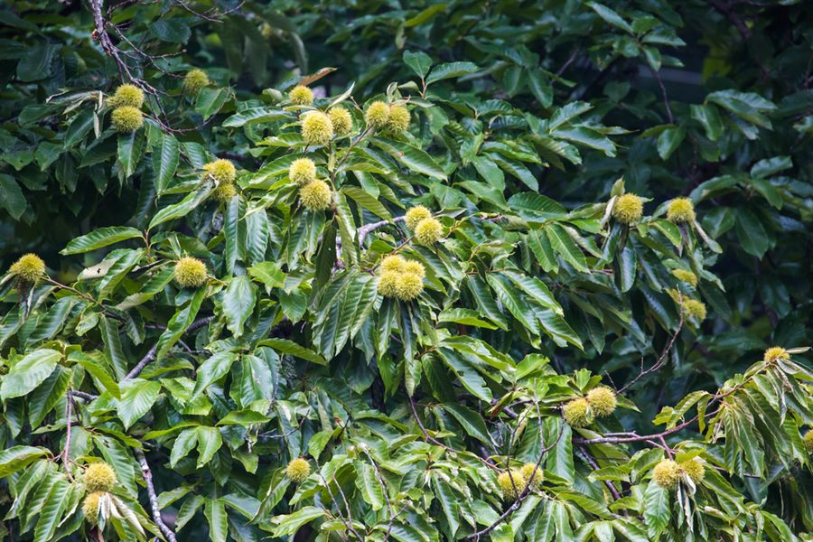 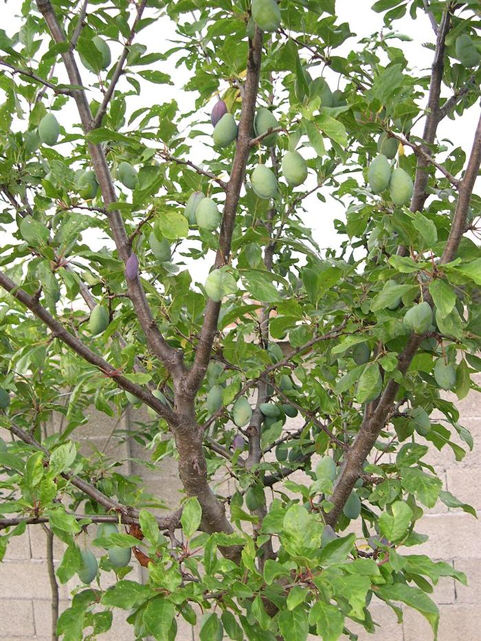

*Hartnoot · Chinese kastanje · kroosje*

<!-- Gilde = een boom met begeleidende planten die elk een taak hebben: stikstof binden, mulch leveren, bestuivers voeden, samenwerken met schimmels. De kersen (twee bomen) komen na de gilden. -->

---

# Inheems of niet?

- Twee doelen: inheems bos herstellen, of hier voedsel telen.
- Onze zandige plek zou van nature beuken-eikenbos zijn.
- Voedsel van hier verlicht de druk op land elders.
- Geen van deze staat op de lijst van invasieve soorten. Duizendknoop wel.

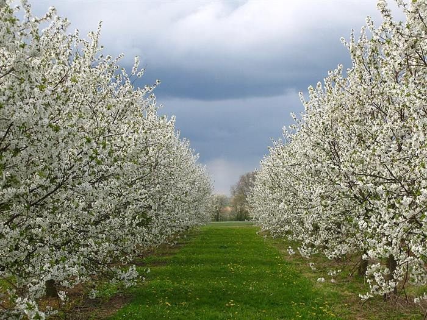

<!-- Het argument van de eigenaar: ons voedsel wordt ergens geteeld, en de rand van een regenwoud of oud bos is voor de natuur meer waard dan onze bouwplek, dus alles wat we zelf telen en eten verlaagt de druk op land elders (een argument, hier niet gekwantificeerd). Als het doel was de toestand van vóór de beschaving te herstellen op een hoge zandige plek zoals de onze, dan wordt het een beuken-eikenbos, zoals delen van de Bourgoyen; eiken-beukenbos is de climaxvegetatie op zandgronden in Vlaanderen (INBO natuurtypologie bossen; Ecopedia, natuurtype Eiken-Beukenbos). De werkelijke bodem van de plek is niet gecontroleerd. Elke andere beplanting is een compromis tussen die toestand en cultuur. Als het doel voedsel is, telen we dat zo bekwaam mogelijk, wat inhoudt dat we beproefde, weerbare voedselplanten kiezen. Verder: kastanje, walnoot, kerspruim en kroosjes hebben hier een lange geschiedenis; de meeste begeleidende planten zijn inheems; wilde Europese kastanje is erg ziektegevoelig; klimaatverandering is een reden om nieuwe soorten en rassen te halen die soorten vervangen die achteruitgaan; Chinese kastanje en hartnoot komen uit een ander deel van Eurazië, hetzelfde continent. Een bescheiden weerbaarheidspunt (niet voor op de dia): bij voedselschaarste vielen mensen in West-Europa terug op eikels, die herhaaldelijk uitgeloogd moeten worden om de bitterheid te verwijderen; gekweekte noten zoals kastanje en walnoot hebben geen uitlogen nodig, smaken veel beter en zijn goed te bewaren (Maraschi, 'The seed of hope. Acorns from famine food to delicacy in European history', Oxford Symposium on Food and Cookery 2018; Medievalists.net, 'Acorns in the Middle Ages'). Details: onderzoeksdocument (Engels), sectie 0. -->
---

# De duizendknoop

- De aannemers pakken de eerste behandeling aan.
- Stam-injectie in het vroege najaar is de waarschijnlijke methode.
- Bomen gaan erin daarna, of met een spuitvrije zone.

<!-- Niet onze beslissing. Bladspuiten drijft af en kan jonge bomen schaden; injectie in de holle stengel blijft in de stengel. Bestrijding duurt meestal 3–5 jaar met herhaalde behandelingen. Andere opties: herhaald maaien, wortelscherm, afgraven (gereglementeerd afval). Details: onderzoeksdocument, sectie 1. -->

---

# 1. Hartnoot naast de fietsenstalling

- Schaduw en een dichte beplanting helpen duizendknoop terug te dringen.
- Hartvormige noten met hele kernen.
- Vult het werk van de aannemers aan, vervangt het niet.

<small>Kopen: [Eetbaargoed 'Anneke'](https://www.eetbaargoed.nl/product/japanse-hartnoot-heartnut-juglans-ailantifolia-anneke/) · [Arborealis](https://www.arborealis.nl/juglans-ailantifolia-cordiformis-c4-60-80)</small>

<!-- Grootte: ongeveer 3–4 m na 5 jaar, 6–8 m na 10 jaar, 15–20 m volgroeid (schattingen). Exacte plek per geval te bepalen. Bewijs: we vonden geen studie die aantoont dat schaduw of juglon van walnoot duizendknoop onderdrukt; wilg vermindert hem wel, maar verdrijft hem niet. Dit is dus een hoop, geen belofte. Hardheid van de schaal: bronnen verschillen; sommigen noemen de schaal hard, kwekers zeggen dat de kern heel uitvalt als je op de rand kraakt. -->

---

# De hartnoot van dichtbij

- Hartvormig; de kern komt heel uit de schaal.
- Verkopers beschrijven een milde, zoete smaak.
- Op de rand gekraakt in een hefboomkraker (rechts).

  

*Simcoe, Imshu, Bernice en de Black Cat-kraker. Foto's: Grimo Nut Nursery*

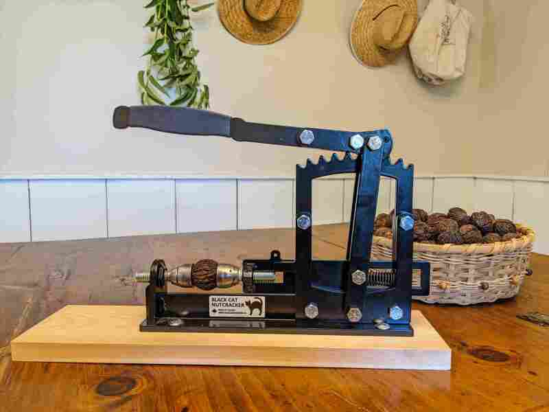

<!-- Black Cat: stalen kraker met dubbele hefboom op een houten plank van Grimo (Canada), CAD 125. In overweging; Grimo noemt hem voor zwarte walnoot, grijze walnoot en hickory en verkoopt hem in een bundel met hartnoten, maar claimt niets over het kraken van hartnoten, en levering naar België is onbevestigd. Hartnoten splijten langs de naad als je op de rand drukt. Deze cultivars komen van een Canadese kwekerij (Grimo) en tonen het type; in NL/BE verkopen ze Anneke, Shubert (een oudere vorm van Imshu), Campbell CW4 en Grimo Manchurican. Verkopers zeggen dat de kern heel uitvalt als je op de rand kraakt; Imshu vraagt zorg. Rijpt eind september, noten vallen en gaan na drogen makkelijk open (Eetbaargoed). -->

---

# Te groot voor die plek?

- Hoogte: 15–20 m.
- Kroon: ~15 m (bereik 9–20 m).
- Gidsen: 15 m+ tussen bomen.

<small>Bronnen: [Eetbaargoed](https://www.eetbaargoed.nl/product/hartnoot-juglans-ailantifolia-schubert/) · [Oregon State](https://landscapeplants.oregonstate.edu/plants/juglans-ailantifolia) · [PFAF](https://pfaf.org/user/Plant.aspx?LatinName=Juglans+ailanthifolia+cordiformis) · [Food Forest Nursery](https://www.foodforestnursery.com/growing-guides/nut-trees/heartnut-trees/)</small>

**Er is een kans dat de boom over 100 jaar de ruimte vult.**

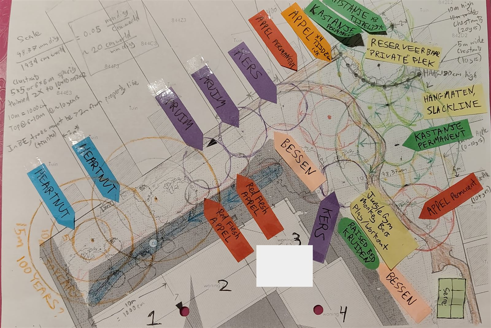

<!-- Citaten: Eetbaargoed (pagina's 'Imshu'/'Shubert', verkoper van de overwogen cultivars): "groeit eerst flink de lucht in tot een hoogte van 15 tot 20 meter en vormt dan een mooie brede kroon" (geen breedte). Oregon State: "to 40-65 ft (15-20 m) tall, broad, round crown". PFAF: ongeveer 20 m x 15 m. Food Forest Nursery en tuingidsen (zoekresultaten, pagina's niet volledig gelezen): 30-50 ft hoog, breedte 30-65 ft (9-20 m), 'laag en breed uitgroeiend, zoals een steeneik', aanbevolen afstand 50 ft (15 m) of meer. Geen bron geeft een breedte voor de specifieke cultivars ('Anneke', 'Shubert', 'Campbell CW4', 'Grimo Manchurican'). De 15 m breedte is een gangbaar cijfer; het bereik is groot. Afstanden tot wortels en warmtepompleidingen: zie docs/research_notes/heat_pump_roots.md. Tijd tot volle grootte: geen bron geeft jaren tot volwassenheid. Jonge bomen kunnen 6-8 ft (1,8-2,4 m) hoogte per jaar toevoegen met vocht en onkruidbeheer (Red Fern Farm, Iowa); een oude boom met 100 ft breedte kan slechts 20-30 ft hoog zijn (Red Fern Farm); Cricket Hill Garden noemt 'Campbell CW1' 80 ft hoog en 50 ft breed 'bij volwassenheid (100 jaar)'. De hoogte komt dus binnen enkele decennia, de volle breedte over vele decennia. Geënte bomen dragen na ongeveer 3-4 jaar noten. De eigenaar voegt de schaaltekening toe. -->

---

# Hartnoot heeft een bestuivingspartner nodig

- Eén enkele hartnoot zet zelden noten.
- Beste partner: een tweede hartnoot, dicht erbij (~5–6 m).
- Een buartnoot kan ook (volgende dia).

<!-- Mannelijke en vrouwelijke bloemen op één hartnootboom bloeien op verschillende momenten (dichogamie). Dicht op elkaar planten of knotten houdt de voetafdruk klein; kost wat noten en geeft scheve kronen. Een walnoot is geen partner voor een hartnoot: de kruising met onze Europese walnoot is onbevestigd (zie de walnootdia). Foto: hartnootkernen, Grimo Nut Nursery. -->

---

# Buartnoot

- Kruising hartnoot x grijze walnoot ('Mitchell').
- Rijke, boterige smaak; bestand tegen kanker.
- Kan een hartnoot bestuiven.

<small>Kopen: [De Nootsaeck 'Mitchell'](https://www.denootsaeck.com/nl/walnootboom-mitchell-buartnut.html)</small>

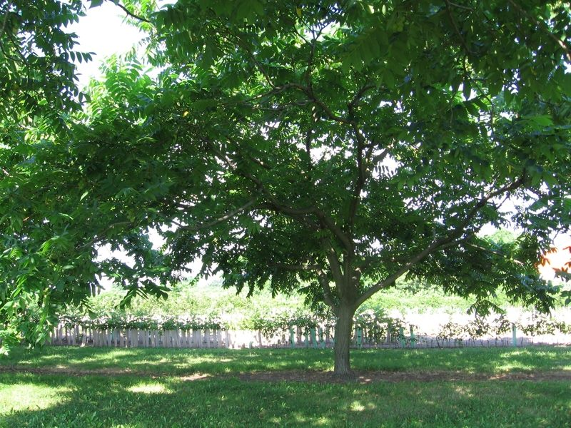
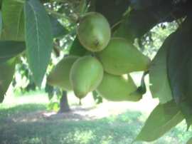

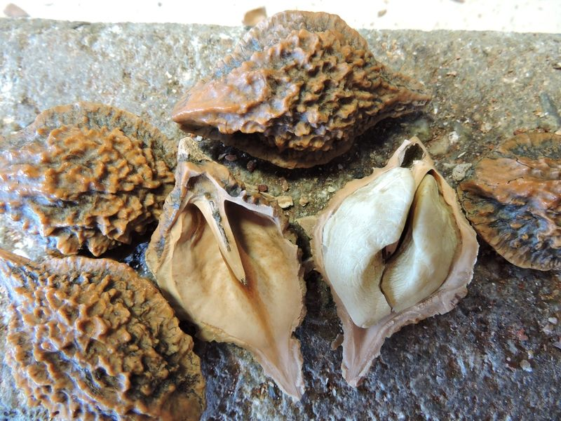 

*Schalen, en de noot binnenin*

<!-- Beschrijvingen van verkopers: de 'Mitchell'-noot "kraakt goed, maakt goed schoon en geeft mooie stukken kern" (Nutcracker Nursery); "wat romige, boterige maar zoete" smaak (De Nootsaeck); noten vallen begin oktober. Buartnoot = grijze walnoot x hartnoot, erft kankerresistentie van de hartnootkant. BEWERINGEN OVER BESTUIVING TEGENSTRIJDIG: Grimo zegt dat de geënte 'Mitchell' met een grijze walnoot bestoven moet worden, De Nootsaeck zegt zelfvruchtbaar. Onopgelost; vraag beide en reken er niet op dat één buartnoot alleen noten zet. Hij zou een hartnoot wel moeten bestuiven (gedocumenteerde kruising). Grote bomen: de verkoper noemt 10-12 m. Foto's: de hele boom en de schaal met de kern erin komen van Grimo's 'Mitchell'-pagina's (daar niet bijgeschreven); de vruchttros (Grimo, lage resolutie, cultivar onbekend) en de vier schalen (Nutcracker Nursery, niet als 'Mitchell' gelabeld) zijn vervangers. -->

---

# Alternatief: een walnoot in plaats van hartnoten

- Eén dunschalige walnoot ('Broadview'), 8–12 m.
- Bestuift met onze bestaande walnoot.
- Hij vervangt de hartnoten; hij is hun partner niet.

<small>Kopen: [Bomen & Enzo](https://www.bomenenzo.nl/walnotenboom-broadview) · [Boomkwekerij Joos](https://www.boomkwekerijjoos.be/nl/referenties/referenties-cat/meerstammige-bomen-cat/juglans-regia-broadview.htm)</small>

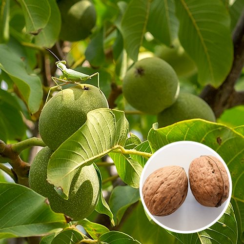

<!-- 'Broadview' is een compacte, gedeeltelijk zelfvruchtbare Europese walnoot die jong draagt en erg winterhard is; bronnen beschrijven dunschalige noten met zo'n 50% kernrendement. Dezelfde soort als onze bestaande walnoot, dus die twee zouden elkaar moeten bestuiven; overlap van de bloei niet gecontroleerd. Of Europees walnootstuifmeel op een hartnoot werkt is onbevestigd, dus reken er niet op als partner voor een hartnoot. Foto: Bomen & Enzo. Bronnen: RHS, Bomen & Enzo, Trees and Shrubs Online. -->

---

# Begeleider: krentenboompje

*Amelanchier lamarckii* · 4–8 m

- Eetbare besjes, lentebloesem.
- Verdraagt schaduw en walnoot.
- Rand van de wadi: waarschijnlijk goed.

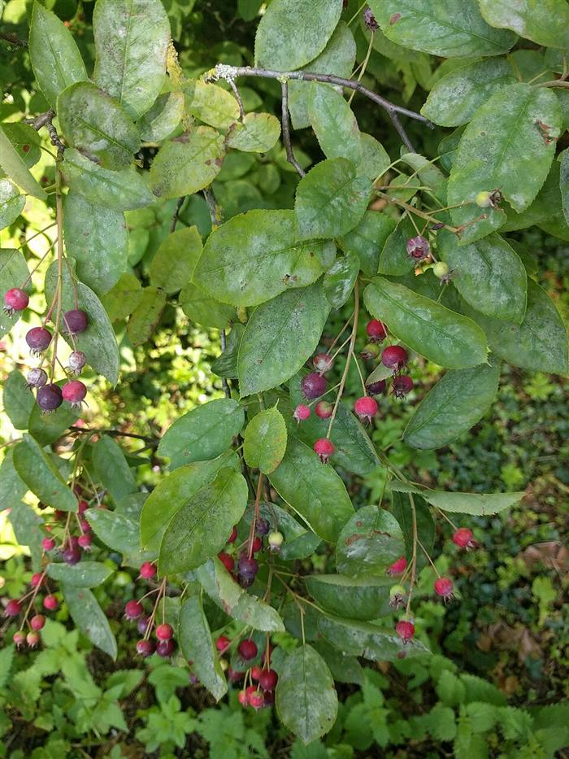

<!-- Krenteboompjes staan op veel lijsten als juglon-tolerant (niet getest bij hartnoot). Zelfvruchtbaar, één boom volstaat. Staat op de RHS-lijst voor natte grond; verdraagt korte overstromingen, verkiest vochtige maar goed doorlatende grond. -->

---

# Begeleider: pawpaw

*Asimina triloba* · ~5 m

- Grote zoete vruchten.
- Verdraagt schaduw en walnoot.
- Heeft een tweede pawpaw nodig binnen ~10–15 m.

<small>Kopen: [De Nootsaeck 'Sunflower'](https://www.denootsaeck.com/nl/pawpaw-boom-asimina-triloba-sunflower.html) · [Eetbaargoed](https://www.eetbaargoed.nl/product/pawpaw-asimina-tribola-kopen/) · [Kwekerij Asimina](https://www.kwekerij-asimina.nl/) · [Bogaert (BE)](https://www.boomkwekerij-bogaert.be)</small>

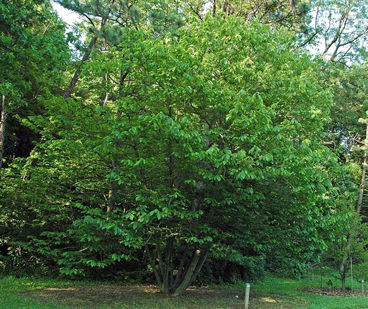

<!-- 'Sunflower' zet alleen vrucht, maar geeft meer met een partner. Vliegen en kevers bestuiven, dus handbestuiving kan nodig zijn. Rijpt begin september tot half oktober in Nederland; betrouwbaarheid in Gent niet bevestigd. Geënte bomen dragen na 3–4 jaar, zaailingen na 5–8. Draagt veel minder in diepe schaduw. Wadi: alleen bovenrand. Duitse kwekers zeggen dat een regenachtige, koele zomer rijping moeilijk maakt; geen Belgische opbrengstgegevens gevonden. Verkrijgbaar bij De Nootsaeck ('Sunflower'), Eetbaargoed en Kwekerij Asimina. -->

---

# Begeleider: Judasboom

*Cercis siliquastrum* · 6–8 m of meer

- Roze bloesem op kale takken, voor de buren.
- De bloemen zijn eetbaar, zoetzuur.
- Niet voor de wadi.

<small>Kopen: [Bomen & Enzo 'Bodnant'](https://www.bomenenzo.nl/cercis-bodnant) · [ATuin](https://www.atuin.be/tuincentrum/struiken/judasboom-cercis-siliquastrum/)</small>

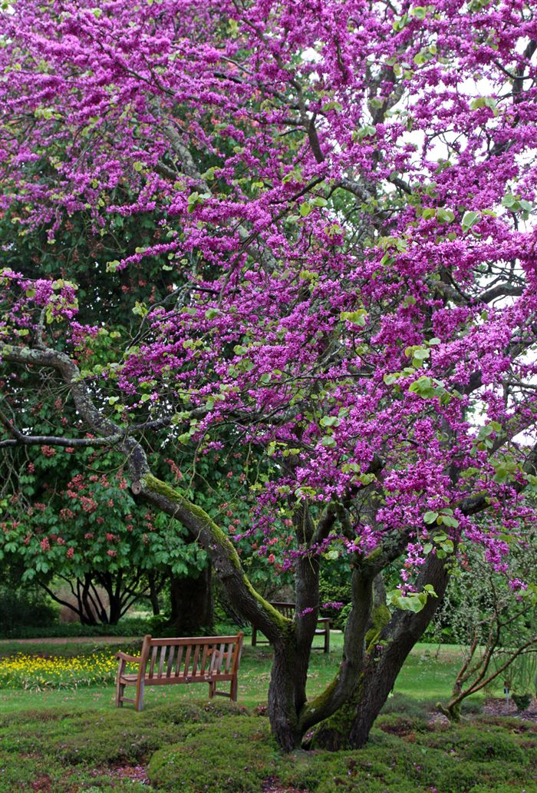

<!-- Cultivars: 'Bodnant' (donkerpaars), 'Alba' (wit). In salades; knoppen ingelegd als kappertjes. Peulen zouden bitter zijn. Eén anekdote: een Franse video uit Nancy waarin een man de bloemen van de boom eet en zegt dat ze lekker zijn. Smaak is verder onbewezen dan beschrijvingen. Groeit volgens meldingen onder walnoten (op geslachtsniveau, niet getest). Houdt van zon en goed gedraineerde grond; houdt niet van natte klei. Eén boom volstaat voor de bloemen. Zaailingen kunnen ~15 jaar nodig hebben om te bloeien; koop een grotere kwekerijboom. 'Bodnant' groeit langzaam, ongeveer 3 m na 10 jaar; verwacht de hoogte dus laat. -->

---

# Begeleider: ondergroei

- Smeerwortel, braam, klaver, bosaardbei.
- Goumi bindt stikstof.
- Houd tomaten en azalea's uit de buurt van de walnoot.

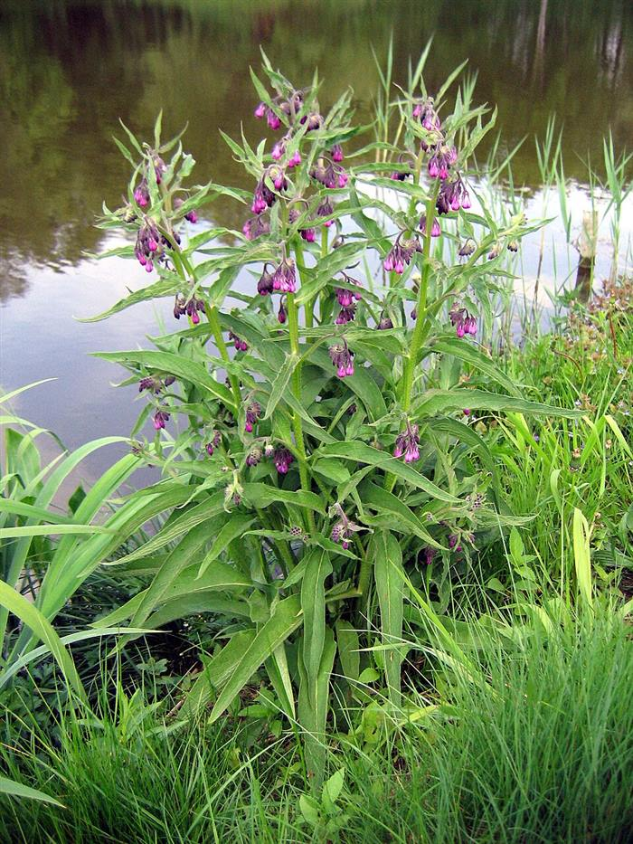

<!-- Deze concurreren op grondniveau met de duizendknoop. Juglon-gevoelige planten blijven buiten de druiplijn van de hartnoot. -->

---

# 2. Kastanje in het noorden

- Elite-zaailingen, eigen wortels, niet geënt.
- Ongesnoeid: een echte bosboom.
- Voor de kleinkinderen.
- Op lange termijn: ruimte voor een slackline tussen twee stammen.

<small>Kopen: [Eetbaargoed Grimo](https://www.eetbaargoed.nl/product/tamme-kastanje-castanea-grimo-serie/) · [Eetbaargoed SemRu](https://www.eetbaargoed.nl/product/tamme-kastanje-castanea-mollisima-label-semru-unieke-genenpoel-afkomstig-uit-noordelijk-beijing/) · [De Bomelaar](https://debomelaar.be/webshop/zaailing-Chinese-kastanje-mollissima-p706207844) · [Calle Steven (BE)](https://www.callesteven.be)</small>

_(27826373314).jpg)

<!-- Zaailingen vermijden enting-uitval en kunnen eeuwen leven. Grootte: ongeveer 2–3 m na 5 jaar, 5–7 m na 10 jaar, 20–30 m volgroeid. Plaatsing informeel. Minstens twee genetisch verschillende bomen nodig voor noten. De foto toont de soort Castanea mollissima; er zijn geen openbare foto's van de genoemde zaailinglijnen. Lange-termijnidee van de eigenaar: een slackline tussen twee kastanjebomen; daarvoor zijn stevige stammen nodig (dikte niet onderzocht) en boombescherming. -->

---

# Waarom Chinese, niet Europese kastanje?

| | Chinees (*mollissima*) | Europees (*sativa*) |
| :--- | :--- | :--- |
| Pellen | Meestal makkelijk | Wisselt |
| Kastanjekanker | Resistent | Gevoelig |
| Inktziekte | Beter bestand | Zeer gevoelig |

   

*Chinese 'Qing'-noten en bolster · Europese noten en bolster*

<!-- Chinese noten worden beschreven als zoet en waskachtig. De notengrootte is bij beide vergelijkbaar; veel cultivars van beide pellen makkelijk. Chinese kastanje is resistent tegen kanker en inktziekte maar gevoelig voor waterverzadiging, dus de drainage van de noordtuin moet vóór het planten gecontroleerd worden. We vonden geen onafhankelijke meldingen over de lijnen Grimo, Hebei North of SemRu in België, Nederland of Duitsland. Fotocredits: 'Qing'-noten, Chestnut Improvement Network; bolster, Canopy Nursery; sativa-foto's, H. Zell (CC BY-SA). -->

---

# Noten boven, paddenstoelen onder

- Kastanjes gaan een samenwerking aan met eekhoorntjesbrood.
- Vooraf geïnoculeerde bomen bestaan.

<small>Kopen: [Robin Pépinières](https://www.robinpepinieres.com) · [Hifas da Terra](https://hifasforesta.com)</small>

<!-- De boom geeft de schimmel suikers; de schimmel geeft mineralen en water. Beheerde bossen in Spanje en China melden tot 40 kg eekhoorntjesbrood per hectare. Wortelkolonisatie van geïnoculeerde Europese kastanje is gedocumenteerd; we vonden geen meldingen van paddenstoelen die hier of bij Chinese kastanje verschijnen, dus zie de paddenstoelenoogst als mogelijke bonus. Bronnen zijn Franse en Spaanse kwekerijen. -->

---

# 3. Een gevarieerd pruimenbosje

- Ongeveer zes soorten, zodat bestuiving ruim volstaat.
- Kleine bomen: 4–6 m volgroeid.
- Oude Belgische pruimen, goed vers en gedroogd.

<small>Kopen: [Willaert 'Bleue de Belgique'](https://www.willaert.be/nl/plant/PRUNUS+DOMESTICA+%27BLUE+DE+BELGIQUE%27/prdbbelg) · [Houtmeyers 'Altesse Double'](https://houtmeyers.be/product/altesse-double/) · [Fruitbomen.net 'Belle de Louvain'](https://fruitbomen.net/webwinkel/pruimenbomen/belle-de-louvain) · [kroosjes (De Bomenshop)](https://www.debomenshop.nl/pruimenboom/1305-prunus-insititia-gele-kroos-kroosjes-pruim.html) · [Calle Steven (BE)](https://www.callesteven.be)</small>

<!-- Kroosjes en Belgische kwetsen ('Altesse Double', 'Bleue de Belgique') hebben een losse pit en drogen goed. Prunus cerasifera is sappiger, met vaste pit: vers eten en onderstam. Nieuwe rassen kunnen na verloop van tijd op worteluitlopers geënt worden, één ras per stam, zodat het een nette groep aparte bomen blijft. Kandidaat-zes (eind juli tot september, voorlopig): 'Sint-Hubertus', rode kroosje, 'Bleue de Belgique', blauwe kroosje, 'Altesse Double', één kerspruim-selectie. De meeste zijn zelfvruchtbaar; bloeidata per ras niet gecontroleerd. Mogelijke verkopers: Willaert, Houtmeyers, Ecoflora, Fruitbomen.net; vraag Calle Steven in Wetteren welke pruimen ze hebben. -->

---

# Enkele voorgestelde variëteiten voor het pruimenbosje

| Sint-Hubertus | Rode kroosje | Bleue de Belgique |
| :--: | :--: | :--: |
| 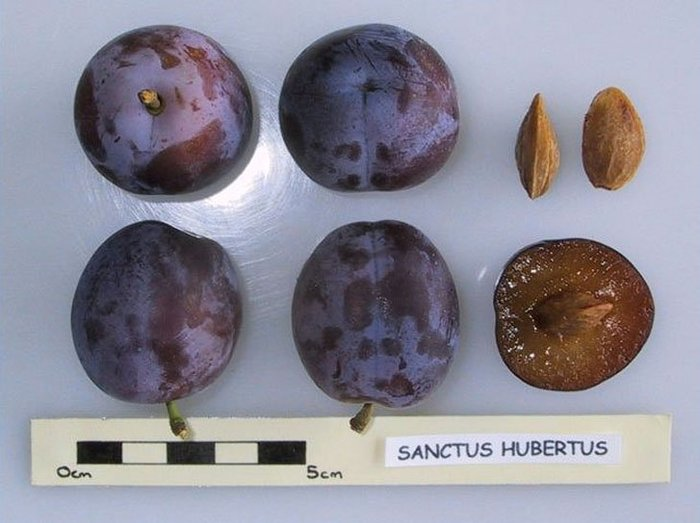 | 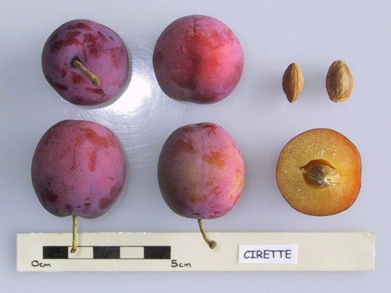 |  |

| Blauwe kroosje | Altesse Double | Kerspruim (*P. cerasifera*) |
| :--: | :--: | :--: |
| 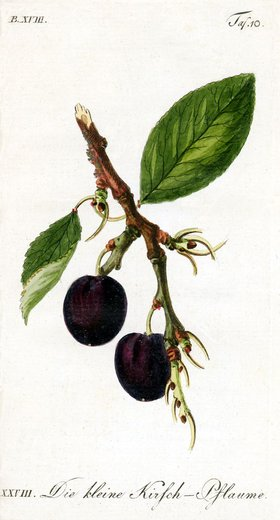 | 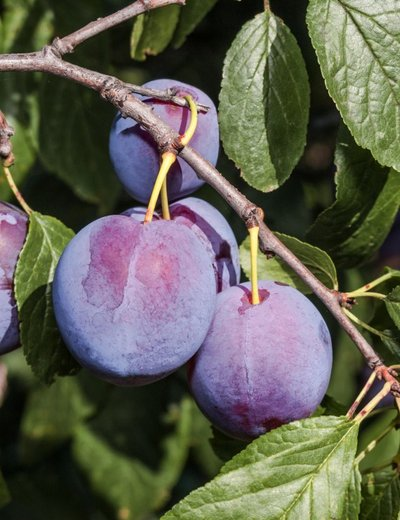 | 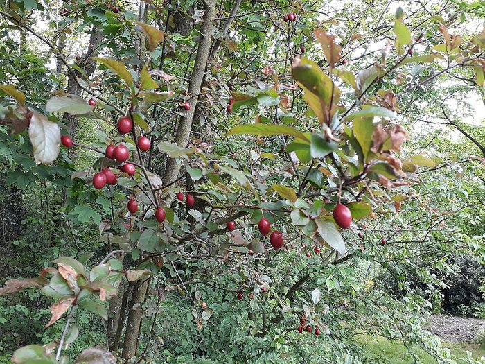 |

<!-- Rijping van eind juli tot september. Sint-Hubertus: vroegst (eind juli/begin augustus), heeft een partner nodig; Bleue de Belgique staat als partner in de lijst. Rode kroosje: half augustus, klein, zoetzuur, vaste pit, zelfvruchtbaar. Bleue de Belgique: half tot eind augustus, zoet en mild, ziektebestendig, goede pollen voor anderen. Blauwe kroosje: eind augustus, klein, losse pit, zelfvruchtbaar. Altesse Double: eind augustus tot september, stevig vlees voor drogen en bakken, late bloei, zelfvruchtbaar. Kerspruim: kleine gele, rode of paarse vruchten; nog geen benoemd ras of Belgische bron gevonden. Een boom in Runa's familie (vermoedelijk een kerspruim) gaf emmers vol vruchten die niet lekker waren; er bestaat een plant die ervan gekweekt is en over een paar jaar kunnen stekken genomen worden, dus beoordeel de smaak voor je je vastlegt. Fotoopmerkingen: 'Cirette' staat voor de rode kroosje (een rood kerspruimtype); de blauwe kroosje is een oude prent, geen foto; de foto's van Altesse Double en Bleue de Belgique zijn kwekersfoto's en slechts indicatief; de kerspruimfoto toont de soort, geen benoemde selectie. Bronnen: docs/research_notes/plums.md. -->

---

# Partners en alternatieven

| Gele kroosje | Belle de Louvain |
| :--: | :--: |
| 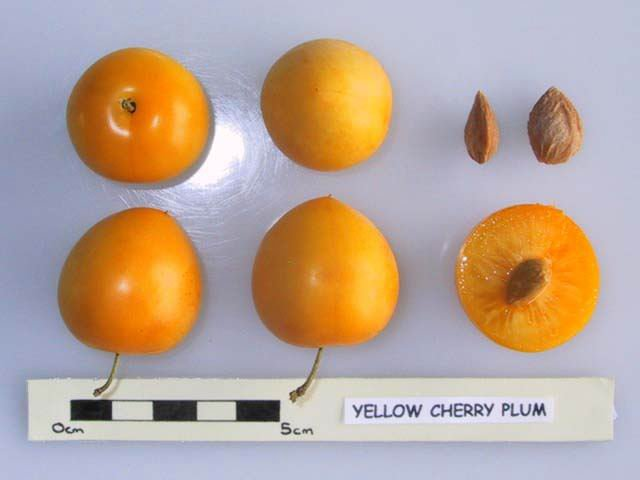 | 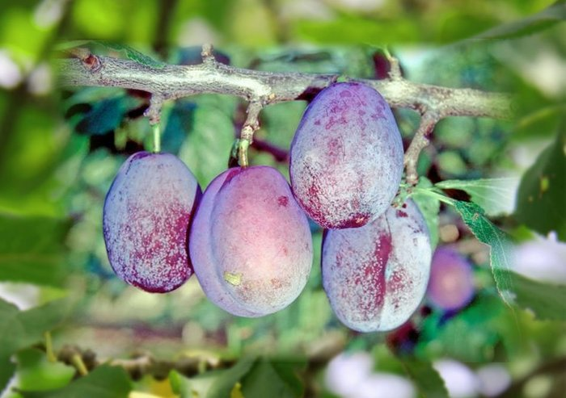 |

<!-- Gele kroosje: klein, rond, geel, vaste pit, veel doorns; ook onderstam; verkocht als 'Gele Kroos' door De Bomenshop; de foto toont een geel kerspruimtype. Belle de Louvain: zeer groot, roodblauw, stevig, tweede helft augustus; te groot voor kleine vruchten maar nuttige bestuiver (partners: Opal, Reine Claude d'Althan, Victoria); gevoelig voor pruimenmot. Mirabelle de Nancy is geschrapt: de eigenaar heeft hem hier zien mislukken. Sainte Cathérine (laat, drogen, oktober) blijft een mogelijk alternatief; nog geen foto. -->

---

# Twee kersenbomen

- Vroege rijping: van de boom voor de natte, vochtige weken.
- Lichte vruchten: vogels laten gele kersen vaak liggen.
- De twee bomen moeten elkaar bestuiven.

| Optie | Rijp | Kleur |
| :--- | :--- | :--- |
| Burlat + Early Rivers | Zeer vroeg | Donkerrood |
| Sunburst of Stella (zelfvruchtbaar) | Vroeg–midden | Donkerrood |
| Dönissens Gelbe (heeft een partner nodig) | Half juli | Geel |

<small>Kopen: [Burlat](https://fruitbomen.net/webwinkel/kersenbomen/bigarreau-burlat) · [Early Rivers](https://fruitbomen.net/webwinkel/kersenbomen/early-rivers) · [Sunburst](https://fruitbomen.net/webwinkel/kersenbomen/sunburst) · [Stella](https://fruitbomen.net/webwinkel/kersenbomen/kersenboom-stella) · [Dönissens](https://fruitbomen.net/webwinkel/kersenbomen/donissens) (all Fruitbomen.net)</small>

<!-- Nadeel: de vroegste zijn donkerrood; de gele is later. Burlat barst bij regen. Onze bestaande 'bigarreau blanc et rose' bestuift misschien een nieuwe boom als hij dichtbij genoeg staat voor bijen (identiteit onbevestigd; mogelijk Napoleon). Geen vroege gele kers met bevestigde partner gevonden. Burlat (S3S9) en Early Rivers (S1S2) delen geen S-allel en zijn dus volledig compatibel; Burlat met Napoleon (S3S4) is maar half compatibel. Bloeitijd van geen enkel paar bevestigd. Burlats resistentie tegen kanker is omstreden. Volledig gele kersen ontsnappen misschien aan vogels; kersen met een blos worden aangevallen zodra ze kleuren. Details: onderzoeksdocument sectie 3.4 en docs/research_notes/cherries.md. -->

---

<!-- _class: credits -->

# Dwergwalnoten: 'Karlik 3' en 'Karlik 5'

- Gekweekt in de Nikitsky Botanische Tuin (Jalta); "karlik" = dwerg.
- Karlik 5: ~1,8-2m na 20 jaar (3 bronnen eens). Karlik 3: iets groter, één bron zegt 3-5m (onbevestigd, wijkt af van andere cijfers).
- Draagt vrucht vanaf jaar 3; dunne schaal (1,5mm), makkelijk te kraken, goede smaak.
- Geënt op gewone walnoot-zaailing — let op onderstamscheuten.
- Naar verluidt onderling vruchtbaar; winterhard tot -23°C.

<small>Kopen: [Lubera (CH/DE, levert in BE)](https://www.lubera.com) · [Baumschule Horstmann (DE)](https://www.baumschule-horstmann.de/walnuss-dwarf-karlik-3-64_126922.html) · [Nusspfleger.at (AT)](https://www.nusspfleger.at/shop/zwergwalnussbaum-karlik-3/) · [Ackerbaum (FR/DE)](https://www.ackerbaum.fr/products/zwerg-walnuss-dwarf-karlik-3) · [Z. Limbach (SK)](https://shop.zahradnictvolimbach.sk/en/walnut-dwarf-karlik5) · Eggert (DE) momenteel uitverkocht, terug ≈augustus</small>

<!-- Groottes: Karlik 5 ~1,8-2m na 20 jaar bevestigd via Nikitsky's eigen pagina, Lubera, en Trees and Shrubs Online (VK) — rechtstreeks gelezen, geen zoekfragmenten. Karlik 3's "300-500cm" komt alleen uit een zoekfragment van Baumschule Horstmann; de pagina zelf gaf 403 en kon niet rechtstreeks geverifieerd worden — zie dit als een onbevestigde uitschieter tegenover de ~2m die elders voor de reeks gevonden werd. Noten: 12g, 43% kern, "goed intensief notenaroma" (Lubera); Karlik 3 beschreven als dunschalig (1,5mm), mild en zoet, vrucht vanaf jaar 3 (Eggert, zoekfragment). Geënt op zaailing van Juglans regia, rechtstreeks bevestigd op Eggert's pagina: "wird auf Walnuss-Sämling, Juglans regia, veredelt" — dus echt dwerg door de ent, niet door een dwergonderstam (die bestaat commercieel niet voor walnoot). Onderlinge vruchtbaarheid en winterhardheid -23°C (zone 6) komen van één bron, nog niet gekruiscontroleerd. Bloeitijd (protandrisch, zoals gewone regia) betekent dat hij mogelijk ook onze oude walnoot kan bestuiven, of omgekeerd — moet bevestigd worden door beide bomen te zien bloeien. Volledige notities: docs/research_notes/small_nut_trees.md. -->

---

# Fotocredits

<small>
Wikimedia Commons: Chinese kastanje (bloeiende tak), Japanse duizendknoop, kroosje, hartnootvruchten, eekhoorntjesbrood, Judasboombloemen (diverse auteurs, CC BY-SA of publiek domein). Hartnootboom: botanische tuin Wroclaw (CC BY-SA 4.0). Kroosjesboom: Aniket Mone (CC BY 2.0). Krentenboompje: Rudolphous (CC BY-SA 4.0). Smeerwortel: Agnieszka Kwiecień (CC BY 2.5). Kersenboomgaard: Geert Budenaerts (CC BY 3.0). Pawpaw: Scott Bauer, USDA ARS. Europese kastanje: H. Zell (CC BY-SA). 
Verkopers: hartnootcultivars en Black Cat-kraker, Grimo Nut Nursery; 'Qing'-noten, Chestnut Improvement Network; kastanjebolster, Canopy Nursery; buartnoten, Nutcracker Nursery; kersen, Fruitbomen.net en Baumschule Eggert. Judasboom in Nancy: schermafbeelding uit een Franse video. Buartnoot 'Mitchell' boom en noot: Grimo Nut Nursery. Pawpawboom: James St. John (CC BY 2.0). Judasboom 'Bodnant': Van den Berk. Kastanjekruin: Melissa McMasters (CC BY, iNaturalist). Pruimen: National Fruit Collection (OGL v2.0) en prenten via Vrienden van het Oude Fruit; Fruitbomen.net; Verstraeten Putte; Régine Fabri (CC BY-SA 4.0). Walnoot 'Broadview': Bomen & Enzo. Volledige lijst: docs/research_notes/image_sources.md.
</small>
